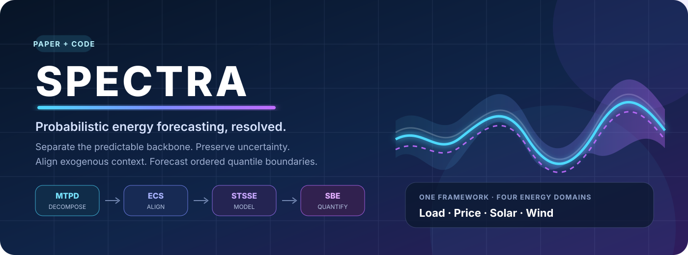
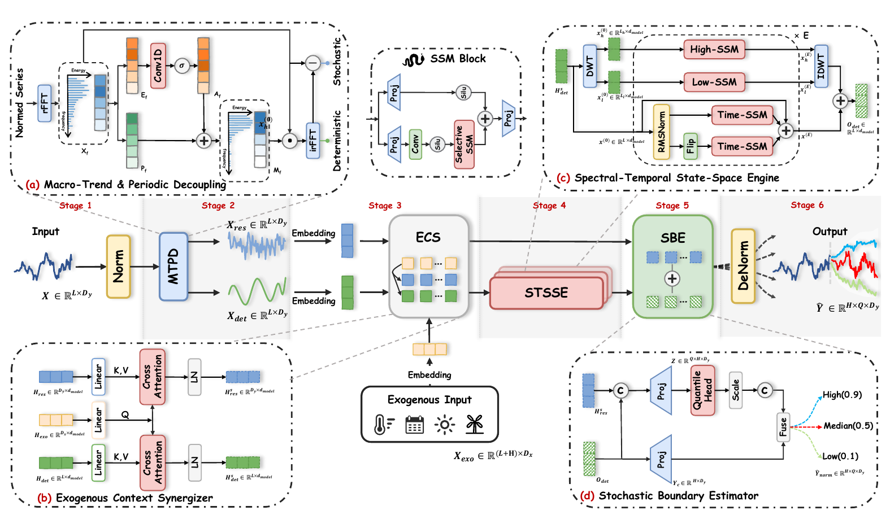
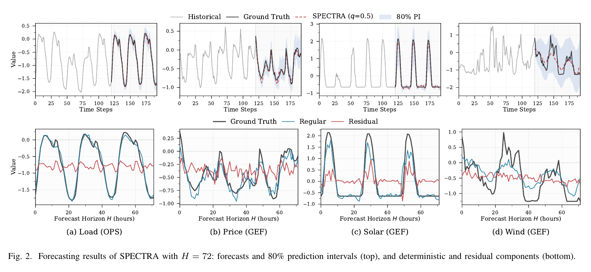
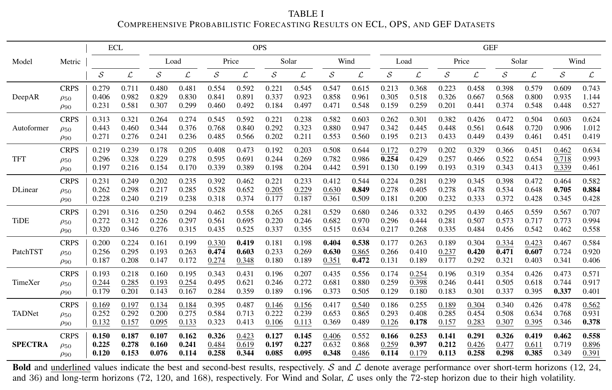

<div align="center">



# SPECTRA

### State-Space Exogenous Context and Temporal-Frequency Resolution Architecture<br>
### for Probabilistic Energy Forecasting

[](paper/SPECTRA_Paper.pdf)
[](https://pytorch.org/)
[](#-the-core-idea)
[](#-benchmark-coverage)

**Forecast the whole distribution - not just its center.**

SPECTRA separates predictable trend-periodic structure from uncertainty-bearing residual fluctuations, aligns both streams with exogenous context, and produces ordered quantile forecasts with a linear-complexity state-space backbone.

[[Paper](paper/SPECTRA_Paper.pdf)] · [[Architecture](#-architecture)] · [[Results](#-results-at-a-glance)] · [[Quick Start](#-quick-start)] · [[Citation](#-citation)]

</div>

---

## ✨ Results at a glance

<table>
<tr>
<td align="center"><h2>14 / 18</h2><b>best CRPS settings</b><br><sub>across ECL, OPS, and GEF</sub></td>
<td align="center"><h2>17 / 18</h2><b>top-two CRPS settings</b><br><sub>consistent across energy domains</sub></td>
<td align="center"><h2>↓ 5.74%</h2><b>average CRPS</b><br><sub>vs. the strongest baseline</sub></td>
<td align="center"><h2>↓ 7.27%</h2><b>upper-tail risk ρ<sub>90</sub></b><br><sub>better extreme-risk estimation</sub></td>
</tr>
</table>

> **The signal behind the numbers:** SPECTRA's largest gains appear in distributional quality and upper-tail risk - exactly where reliable energy-system decisions need more than a point forecast.

## 💡 The core idea

Energy time series mix two very different kinds of information:

- **Predictable structure** - operating cycles, seasonality, and slowly varying trends largely determine the forecast center.
- **Uncertainty-bearing variation** - renewable ramps, price spikes, weather perturbations, and flexible-load disturbances shape interval width and asymmetry.

SPECTRA gives them **specialized but coupled pathways**:

<table>
<tr>
<td width="25%" valign="top">
<h3>🌊 MTPD</h3>
<b>Macro-Trend & Periodic Decoupling</b><br><br>
An input-adaptive spectral mask separates the trend-periodic backbone from high-frequency residuals without a fixed temporal window.
</td>
<td width="25%" valign="top">
<h3>🧭 ECS</h3>
<b>Exogenous Context Synergizer</b><br><br>
Parallel cross-attention routes weather, calendar, market, and system context differently to deterministic and residual streams.
</td>
<td width="25%" valign="top">
<h3>〽️ STSSE</h3>
<b>Spectral-Temporal State-Space Engine</b><br><br>
Wavelet multi-resolution analysis and bidirectional selective SSMs refine long-range structure with linear sequence complexity.
</td>
<td width="25%" valign="top">
<h3>🎯 SBE</h3>
<b>Stochastic Boundary Estimator</b><br><br>
Deterministic and residual representations jointly produce distribution-free, direction-aware quantile boundaries.
</td>
</tr>
</table>

In one line:

```text
energy history → normalize → decompose → align exogenous context
               → refine deterministic structure → estimate stochastic boundaries → quantiles
```

## 🏗️ Architecture

<div align="center">

<br>
<sub><b>Figure 1.</b> Six-stage SPECTRA pipeline and the four core modules.</sub>
</div>

The design is deliberately asymmetric:

1. **MTPD** uses rFFT energy and an adaptive low-frequency mask to split the normalized series.
2. **ECS** aligns shared exogenous tokens with each component through separate attention routes.
3. **STSSE** applies wavelet low/high branches plus forward/backward selective state-space scans to the deterministic stream.
4. **SBE** anchors the median around the refined backbone and uses residual evidence to shape lower and upper quantiles.
5. A quantile-regression objective, optionally paired with spectral regularization, trains the complete system end to end.

## 📈 What does SPECTRA learn?

<div align="center">

<br>
<sub><b>Figure 2.</b> Forecasts at H = 72. Intervals expand around ramps, spikes, and volatile transitions, while the regular stream tracks smooth operating structure.</sub>
</div>

The upper row shows median forecasts and **80% prediction intervals**. The lower row opens the model: the regular component follows the stable trajectory, while the residual component reacts to local uncertainty. This separation is visible across load, price, solar, and wind.

## 🧪 Benchmark coverage

| Dataset | Energy tasks | Resolution / scope | What it tests |
|:--|:--|:--|:--|
| **ECL** | Electricity load | 321 hourly client series | Large-scale multivariate load forecasting |
| **OpenPowerSystem (OPS)** | Load, price, solar, wind | Hourly; 59 / 31 / 36 / 57 series | Cross-domain generality with heterogeneous targets |
| **GEFCom2014 (GEF)** | Load, price, solar, wind | Competition tracks with task-specific covariates | Probabilistic forecasting under weather and market context |
| **NewEnergy2025 (NE)** | Solar, wind | 5 PV plants + 5 wind farms; 15-minute data | Cross-plant transfer and recent renewable-generation conditions |

Compared methods cover autoregressive probabilistic models, covariate-aware architectures, Transformers, decomposition models, and lightweight MLP/linear forecasters: **DeepAR, TFT, TADNet, Autoformer, PatchTST, TimeXer, TiDE, DLinear**, and others included in the repository.

### Comprehensive results - Table I

<div align="center">

<br>
<sub><b>Table I.</b> Comprehensive probabilistic forecasting results on ECL, OPS, and GEF. Bold and underlined values indicate the best and second-best results.</sub>
</div>

Table I compares nine methods over **18 short- and long-horizon settings**:

- **SPECTRA ranks first in CRPS in 14 of 18 settings and within the top two in 17.**
- Its average **CRPS improves by 5.74%** over the strongest competing baseline.
- It achieves the best upper-tail risk **ρ₉₀ in 14 settings**, with an average improvement of **7.27%**.
- The gain is larger for distributional quality and upper-tail risk than for median accuracy (**1.78% on ρ₅₀**), showing that SPECTRA improves the predictive distribution rather than only its center.

Here, **S** averages short-term horizons of 12, 24, and 36 steps, while **L** averages long-term horizons of 72, 120, and 168 steps. For solar and wind, **L** uses the 72-step horizon because of their higher volatility. Lower is better for all metrics.

## 🚀 Quick start

### 1. Clone and enter the repository

```bash
git clone https://github.com/yedadasd/SPECTRA.git
cd SPECTRA
```

### 2. Create the environment

Install a PyTorch build compatible with your CUDA toolkit first, then install the remaining packages:

```bash
conda create -n spectra python=3.10 -y
conda activate spectra

# Choose the PyTorch command for your CUDA version:
# https://pytorch.org/get-started/locally/

pip install numpy pandas scikit-learn matplotlib tqdm \
  PyWavelets pytorch-wavelets mamba-ssm einops reformer-pytorch \
  statsmodels arch netCDF4
```

> [!NOTE]
> A CUDA-capable GPU is recommended for `mamba-ssm`. The paper reports experiments on a single NVIDIA A30 GPU.

### 3. Prepare datasets

The experiment scripts expect preprocessed CSV files under `./dataset/`:

```text
dataset/
├── electricity/
│   └── electricity.csv
├── OpenPowerSystem/
│   ├── load/load.csv
│   ├── price/price.csv
│   ├── solar/solar.csv
│   └── wind/wind.csv
├── GEFCom2014/
│   ├── Load/Load_OT.csv
│   ├── Price/Price_OT.csv
│   ├── Solar/Solarz{zone}_OT.csv
│   └── Wind/Windz{zone}_OT.csv
└── NewEnergy/
    ├── solar{station}_v2.csv
    └── wind{station}_v2.csv
```

Dataset preprocessing utilities are available in [`data_provider/`](data_provider/).

### 4. Launch SPECTRA

Run a complete ECL sweep:

```bash
bash scripts/ECL_script/SPECTRA.sh
```

Run individual task families:

```bash
# OpenPowerSystem
for task in load price solar wind; do
  bash "scripts/OpenPowerSystem_script/SPECTRA_OpenPowerSystem_${task}.sh"
done

# GEFCom2014
bash scripts/GEFCom2014_script/SPECTRA_GEFCom2014_all.sh

# NewEnergy2025
bash scripts/NewPower_script/SPECTRA_NewEnergy_all.sh
```

Or configure one experiment directly:

```bash
python -u run.py \
  --task_name long_term_forecast \
  --is_training 1 \
  --root_path ./dataset/electricity/ \
  --data_path electricity.csv \
  --model_id ECL_168_72 \
  --model SPECTRA_I \
  --data custom \
  --features M \
  --seq_len 168 \
  --pred_len 72 \
  --enc_in 321 \
  --c_out 321 \
  --d_model 512 \
  --e_layers 3 \
  --expand 1 \
  --d_state 16 \
  --d_conv 2 \
  --batch_size 32 \
  --learning_rate 0.0005 \
  --loss_type quantileLoss \
  --quantiles "[0.1, 0.5, 0.9]"
```

Checkpoints and evaluation artifacts are written to:

```text
checkpoints/    # best model weights
test_results/  # forecast visualizations
results/       # metrics, predictions, targets, and inputs
```

## 🗂️ Repository map

| Path | Purpose |
|:--|:--|
| [`models/SPECTRA_I.py`](models/SPECTRA_I.py) | MTPD, ECS, STSSE, SBE, and the complete SPECTRA model |
| [`data_provider/`](data_provider/) | Dataset loaders and preprocessing utilities |
| [`exp/`](exp/) | Training, validation, testing, and artifact export |
| [`scripts/`](scripts/) | Reproducible commands for every dataset, task, horizon, and baseline |
| [`layers/`](layers/) | Shared embedding, normalization, attention, and sequence layers |
| [`utils/`](utils/) | Losses, probabilistic metrics, scheduling, and visualization |


## 📝 Citation

If SPECTRA helps your research, please cite:

```bibtex
@misc{ye2026spectrastatespaceexogenouscontext,
      title={SPECTRA: State-Space Exogenous Context and Temporal-Frequency Resolution Architecture for Probabilistic Energy Forecasting}, 
      author={Hang Ye and Xinyan Jiang and Yuedong Shi and Yangxin Zhu and Jianming Wei and Tian Zheng and Xiaoying Zheng and Yongxin Zhu},
      year={2026},
      eprint={2607.20587},
      archivePrefix={arXiv},
      primaryClass={stat.ML},
      url={https://arxiv.org/abs/2607.20587}, 
}
```

## 📬 Contact

Questions and research discussions are welcome:

- **Hang Ye:** `yehang@sari.ac.cn`
---

<div align="center">

**If you find SPECTRA useful, consider starring the repository ⭐**

<sub>Built for safer, sharper, and more uncertainty-aware energy forecasting.</sub>

</div>
